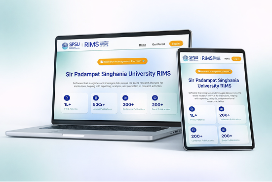

# 🚀 Research Information Management System (RIMS)

> A premium, modern, and comprehensive platform for institutional academic research management.

[](https://rims-spsu.netlify.app/)
[](https://opensource.org/licenses/MIT)
[](https://react.dev/)
[](https://firebase.google.com/)

---

## 🌟 Overview

**RIMS** (Research Information Management System) is a state-of-the-art web application designed to streamline, track, and showcase the dynamic research contributions of academic institutions. Built with a **premium glassmorphism aesthetic**, it provides a role-based environment that facilitates seamless data entry for researchers and powerful analytics for administrators.



---

## 🛠️ Technology Stack

| Category | Technology | Purpose |
| :--- | :--- | :--- |
| **Frontend** | React 19 + Vite | High-performance, functional UI |
| **Language** | TypeScript | Type-safety & robust architecture |
| **Styling** | Tailwind CSS v4 | Scalable, modern utility styling |
| **Components** | Radix UI + Shadcn | Accessible & premium primitive components |
| **State** | Zustand + Query | Effortless global & server state management |
| **Backend** | Firebase Admin SDK | Secure server-side administrative logic |
| **Database** | Firestore | Real-time, scalable NoSQL storage |
| **Auth** | Firebase Auth | Secure, role-based user authentication |
| **Functions** | Netlify Functions | Serverless backend for Admin SDK operations |
| **Visuals** | Recharts + Framer Motion | Dynamic visual analytics & fluid animations |

---

## 🏗️ Platform Architecture

RIMS utilizes a modern **Serverless Architecture**:
- **Front-end**: Hosted on Netlify, ensuring global performance and reliability.
- **Serverless Backend**: Admin operations (e.g., user creation, status management) are offloaded to **Netlify Functions**, allowing secure interaction with the **Firebase Admin SDK**.
- **Data Persistence**: Firestore provides real-time updates and flexible document-based research storage.
- **File Assets**: Firebase Storage manages all uploaded research documents and user profile pictures.

---

## 👥 User Personas & Views

### 👑 Administrator Workspace
The Admin suite allows for total governance over the institution's research data.
- **Global Dashboard**: Unified view of research output trends, researcher activity, and domain-wise distributions.
- **User Management**: Complete control over faculty accounts—create users, deactivate accounts via Admin SDK, and manage roles.
- **Review System**: Approve or reject research record submissions with administrative remarks.
- **Research Lifecycle**: Filter and search through Global Records (IPR, Journals, Books, etc.) to monitor institutional metrics.

### 🔬 Researcher Workspace (User)
Designed for individual faculty members to maintain their professional research portfolio.
- **Researcher Dashboard**: Quick view of personal submission metrics, status of pending approvals, and recent activity.
- **Portfolio Management**: Submit and edit various research types (Journal, Conference, IPR, etc.) with automated form validation.
- **Document Management**: Upload and track attachments for each research record.
- **Profile Customization**: Update personal faculty information, professional details, and profile images.

---

## 📝 Research Modules

Manage the entire lifecycle of high-impact research contributions:
-   💡 **IPR Management**: Patents, Copyrights, and Trademarks with detailed status tracking.
-   📰 **Journal Publications**: Log impact factors, citations, and publication timelines.
-   🗣️ **Conferences**: Capture paper presentations, proceedings, and keynote sessions.
-   📚 **Books & Chapters**: Catalog authored books and specific book chapter contributions.
-   💼 **Consultancy Projects**: Track industry collaborations, funding, and grant statuses.
-   🏆 **Awards & Recognitions**: Highlight professional honors and academic achievements.
-   🎓 **PhD Supervision**: Dedicated tracker for supervising PhD students and their progress.
-   🎤 **Events Monitoring**: Documentation for Workshops, FDPs, and High-level Seminars.

---

## 🚀 Getting Started

### Local Setup
1. **Clone & Install**:
   ```bash
   git clone https://github.com/Self-Lakshh/Research-Information-Management-System.git
   cd Research-Information-Management-System
   pnpm install
   ```
2. **Environment Configuration**:
   Create a `.env` in the root and add your Firebase credentials (`VITE_FIREBASE_API_KEY`, etc.).
3. **Run Dev**:
   ```bash
   pnpm run dev
   ```

### Deployment Configuration
For production, ensure the `netlify.toml` redirects are handled:
```toml
[[redirects]]
  from = "/api/*"
  to = "/.netlify/functions/:splat"
  status = 200
```

---

## 📬 Contact & Support

For support or collaboration:
- **GitHub**: [Self-Lakshh](https://github.com/Self-Lakshh)
- **Email**: Support available within the institution's IT helpdesk.

---

*Engineered with excellence for Academic Research Communities.*
